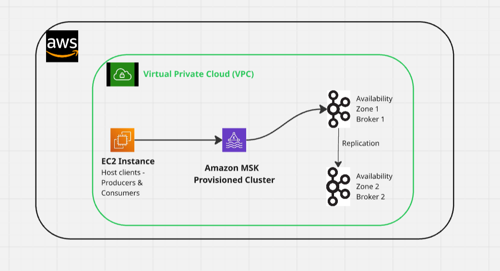
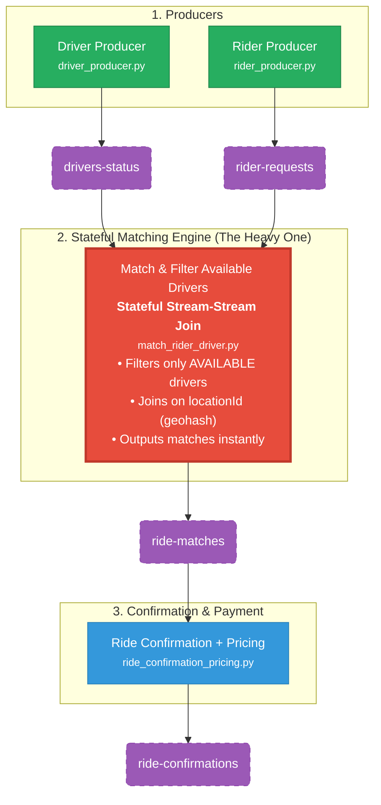
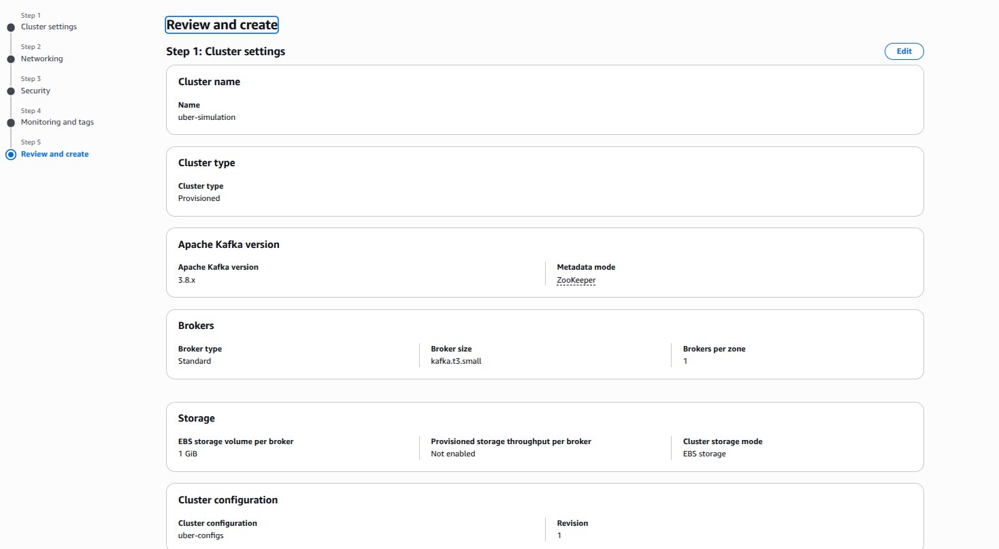
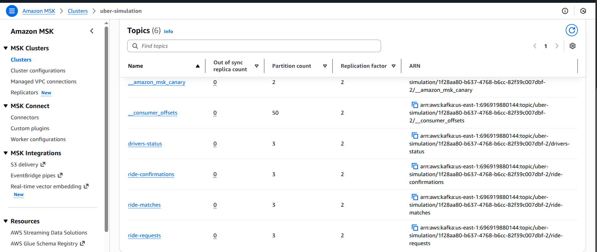

# 🚖 Real-Time Ride-Hailing Simulation Using Apache Kafka (MSK)

This project simulates a real-time Uber-like ride-hailing backend using *AWS MSK, **Kafka Streams (Python)*, and multiple producers/consumers.  
It is NOT a real production system — it is a *controlled simulation* designed to:

✅ Simulate simple idea of uber's pipeline
✅ Build multi-stage streaming pipeline
✅ Create stateless + stateful stream processors  
✅ Observe MSK behavior under load (delays, throttling)

---

# 🚀 System Architecture Overview



Simulation is made of *5 streaming steps*, handled by 4 seperate python scripts.

The simulation generates:

- 🚗 driver events  
- 🙋 rider requests  
- 🧮 streaming transformations  
- 🤝 ride matching  
- ✔️ ride acceptance  
- 💸 final payment events  

Each step produces or consumes Kafka topics to form a complete real-time pipeline.

---

# 🔥 STEP 1 — Driver Producer (Stateless)

A Python producer generates random driver events:

```json
{
  "driverId": "driver_21",
  "status": "AVAILABLE",
  "location": { "lat": 30.05, "lng": 31.2 },
  "locationId": "u4pruy",
  "timestamp": "2025-11-24T20:18:30Z"
}
```
Topic: drivers-status

Simulation idea:
This script mimics drivers coming online/offline continuously, generating constant load into MSK.

### Why We Use locationId (Geohash) Instead of Raw lat/lng

According to simple research this approach is used by Uber, Lyft, Careem, Bolt, etc.
Matching riders and drivers by exact latitude/longitude is impossible in real-time streaming:

- Floating-point coordinates are never exactly equal (even 1 meter apart → completely different numbers)  
- No efficient way to perform spatial joins on streaming data at scale  
- Would kill performance and make the pipeline unusable

*Solution: locationId = Geohash*

We convert every (lat, lng) into a short string (geohash) that represents a small geographic area (~150m × 150m).

```json
// Same locationId → same zone → eligible for matching
{
  "driverId": "driver_87",
  "locationId": "svv9w3x1"    // geohash
}

{
  "riderId": "rider_412",
  "locationId": "svv9w3x1"    // same geohash → match possible
}
```


# 🔥 STEP 2 — Rider Producer (Stateless)

A Python producer Emits rider requests:

```json
{
  "proposalId": "...",
  "requestId": "...",
  "riderId": "rider_9",
  "locationId": "u4pruy",
  "request_status": "NEW"
}
```
Topic: rider-requests

Simulation idea:
Simulates real users requesting rides randomly → high traffic on the cluster.


# 🔥 STEP 3 — Stream App 1: Filter Available Drivers (Stateless)

Reads driver-status → keeps only drivers with:

status == "AVAILABLE"


Outputs to:

Topic: ride-matches

Simulation idea:
A pure transformation step — high throughput, zero state.


# 🔥 STEP 4 — Stream App 2: Match Rider With Drivers (Stateful Join)

Joins:

rider-requests

active-drivers

Matching based on locationId.

Example output:
```json
{
  "riderId": "rider_5",
  "driverId": "driver_34",
  "locationId": "u4prux"
}
```

Topic: ride-matches

Simulation idea:
A stream-stream join is one of the heaviest Kafka operations → ideal to stress MSK.


# 🔥 STEP 5 — Stream App 5: Rider Receives Offer + Final Confirmation + Price

Consumes:

ride-matches

Produces:

Topic: ride-confirmations

Example:

{
  "riderId": "rider_5",
  "driverId": "driver_34",
  "status": "CONFIRMED"
}


Simulation idea:
Another join → adds more logic, load, and latency.


## Real-Time Pipeline Flowchart




## Deployment & Real-World Testing Journey

This project was built and validated in *two phases*:

### Phase 1: Local Development & Validation (Docker)
- Ran a *local kafka broker* using Docker + confluentinc/cp-kafka images
- *KRaft* mode
- All 4 Python scripts (driver_producer.py, rider_producer.py, ride_matcher.py, ride_confirmer.py) were developed and fully tested locally

*Result:* Pipeline 100% functional before touching AWS.

### Phase 2: Full AWS MSK Deployment

#### 1. Created Amazon MSK Provisioned Cluster
- Cluster type: *Provisioned*
- Broker node type: kafka.t3.small → perfect for development + intentional overload testing
- 1 broker, 2 AZ (least resources)
- Storage: 1 GB EBS per broker (least resources)
- Enabled *Basic Monitoring*  → essential to watch the broker's metrics



#### 2. Launched EC2 Client Instance
- Instance: t3.micro (Amazon Linux 2 Free Tier)
- Placed in *same VPC* as MSK
- Attached IAM role with:
  json
  "AmazonMSKReadOnlyAccess",
  

Security Group for MSK's subnet: allowed inbound role from EC2 subnet

#### 3. Installed Required Tools on EC2
```Bash Java (required by Kafka tools)
sudo yum install java-1.8.0

# Download & extract Kafka client tools (v2.6.2)
wget https://archive.apache.org/dist/kafka/2.6.2/kafka_2.12-2.6.2.tgz
tar -xzf kafka_2.12-2.6.2.tgz


# Python + pip
sudo yum install python3 python3-pip -y
pip3 install kafka-python
```
#### 4. Created Topics on MSK Cluster
```Bash
cd kafka_2.12-2.6.2
/opt/kafka/bin/kafka-topics.sh --create \
  --bootstrap-server b-1.yourcluster.xxx.kafka.us-east-1.amazonaws.com:9092,b-2.yourcluster.xxx.kafka.us-east-1.amazonaws.com:9092 \
  --replication-factor 2 \
  --partitions 6 \
  --topic drivers-status \
```

Repeated for: rider-requests, ride-matches, ride-confirmations

MSK Cluster & Topics Created

#### 5. Transferred Python Scripts
```Bash
 scp -i <your-key.pem> <the_folder_of_your_scripts/*.py> ec2-user@your-ec2-ip:/home/ec2-user/
```
#### 6. Ran the Full Pipeline
```Bash
python3 driver_producer.py &
python3 rider_producer.py &
python3 match_rider_driver.py &
python3 ride_confirmation_pricing.py &
```

## Credits & Acknowledgments

This project would not have been possible without the inspiration and guidance from the following sources:

- Kafka Master **Eng. Karim Tawfik** – The original idea of building a real-time Uber-like simulation Kafka was inspired by his amazing content and teaching style. Huge respect and thanks!  
  Follow him: [Linkedin - Karim Tawfik](https://www.linkedin.com/in/karim-tawfik-a8a3aa45/)

- **Official AWS YouTube Video** – All MSK cluster creation, VPC/subnet configuration, EC2 setup, IAM roles, and security group settings were based on the excellent step-by-step tutorial from AWS itself:  
  [Deploy a Kafka Cluster on Amazon MSK](https://www.youtube.com/watch?v=5WaIgJwYpS8&t=232s)

- Geohash-based matching technique is industry standard (used by Uber, Lyft, Careem, Bolt, etc.)

**Thank you both for making complex streaming systems understandable and fun to break!**

---
